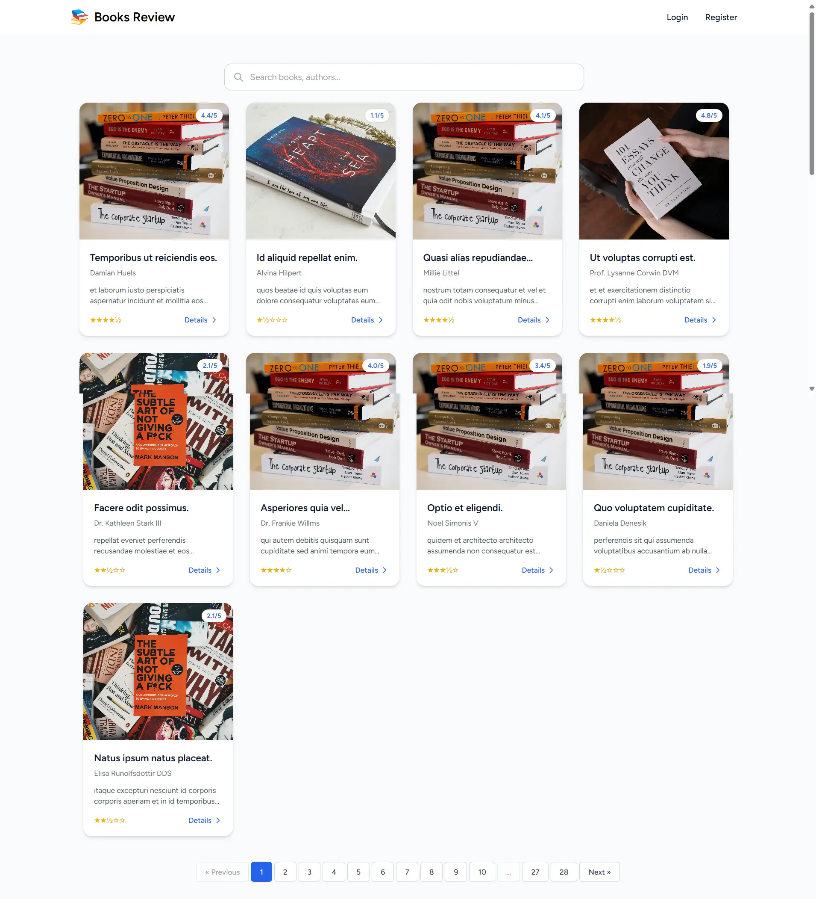

# Book Review Application

## Features

- Modern Laravel 11 backend with expressive routing and Eloquent ORM
- SPA frontend using Vue 3 and Inertia.js
- Authentication with Laravel Sanctum and Socialite (OAuth)
- Toast notifications via Vue3-Toastify
- Utility-first styling with Tailwind CSS
- Database-backed sessions, cache, and queues
- Environment-based configuration for flexible deployment
- PestPHP for testing
- Ziggy for sharing Laravel routes with Vue
- Ready-to-use development environment with Laravel Sail

## Tech Stack

- **Backend:** Laravel 11 (PHP 8.2+)
- **Frontend:** Vue 3, Inertia.js
- **Styling:** Tailwind CSS, PostCSS
- **Build Tool:** Vite
- **Authentication:** Sanctum, Socialite
- **Testing:** PestPHP
- **Routing:** Ziggy
- **Dev Environment:** Laravel Sail

## Getting Started

### Prerequisites

- PHP 8.2 or higher
- Composer
- Node.js and npm
- Docker (optional, for Laravel Sail)

### Installation

1. Clone the repository:
   ```bash
   git clone https://github.com/kamrankhan001/book-review.git
   cd book-review
   ```

2. Install backend dependencies:
   ```bash
   composer install
   ```

3. Install frontend dependencies:
   ```bash
   npm install
   ```

4. Copy and update environment configuration:
   ```bash
   cp .env.example .env
   php artisan key:generate
   ```

5. Set up the database and run migrations:
   ```bash
   php artisan migrate
   ```

6. (Optional) Seed initial data:
   ```bash
   php artisan db:seed
   ```

7. Start the Laravel server:
   ```bash
   php artisan serve
   ```

8. Start the frontend development server:
   ```bash
   npm run dev
   ```

### Running with Laravel Sail (Docker)

1. Start Sail:
   ```bash
   ./vendor/bin/sail up -d
   ```

2. Run the necessary commands inside Sail:
   ```bash
   ./vendor/bin/sail artisan migrate
   ./vendor/bin/sail npm run dev
   ```

## Testing

Run tests using Pest:
```bash
./vendor/bin/pest
```

## Code Style

Ensure code quality with Laravel Pint:
```bash
./vendor/bin/pint
```

## License

This project is open-source and available under the [MIT license](LICENSE).
